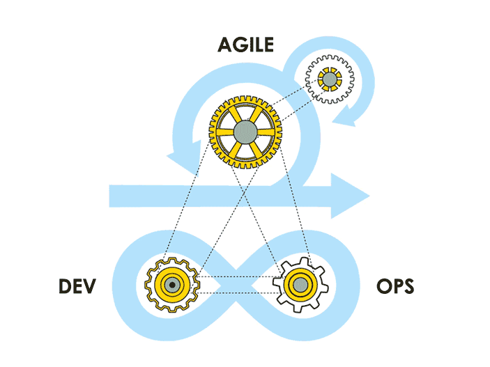

# "Howdy trupers 👍"

###### "Wecome to my simple scribbles, if it helps you, I am happy"

### About me
A tech enthusiast looks on different options for infrastructure provisioning, managing and longevity during it's life time. 

 </img>

### My tech interests/experiances
- automation
- bash scripting
- Terraform
- Ansible
- AWS
- ESXi Servres
- Cloud Email providers (Google Workspace, Office 365)
- Python
- Linux
- Windows
- Zimbra mail hosting
- docker
- kubernetes (on premise)
